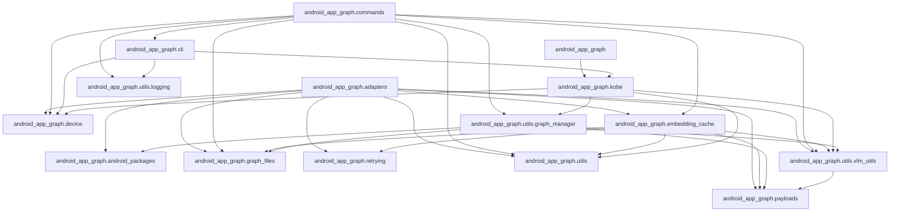

# Android-App-Graph

Android-App-Graph is a graph-based exploration and runtime framework for mobile
GUI agents, forked from [UI-KOBE](https://github.com/YuxiangChai/UI-KOBE) by
Yuxiang Chai. It explores Android apps, builds state-transition graphs, and lets
downstream agents use those graphs to navigate apps more reliably.

The repository has two main uses:

1. Build a UI knowledge graph for an Android app.
2. Use the graph inside [AITK](https://github.com/YuxiangChai/AITK) or
   [Android World](https://github.com/google-research/android_world) agents.

## How It Works

1. **Explore an app.** Android-App-Graph opens an Android app on an emulator, observes the
   current screen, chooses an exploration action, and records the result.
2. **Build a graph.** Each app state becomes a graph node. Actions that move the
   app between states become graph edges.
3. **Run graph-guided agents.** The Android-App-Graph v2 runtime loads the graph, matches
   the current screen to a node, and chooses the next action from nearby graph
   edges or a free-form fallback action.

## Repository Layout

```text
Android-App-Graph/
├── src/
│   └── android_app_graph/             # The installable package; the only directory in the wheel
│       ├── adapters/                  # AITK translator, imported by the copy-in shim
│       ├── cli.py                     # app-graph command
│       ├── commands/                  # app-graph-audit, app-graph-plot, app-graph-embed
│       ├── kobe.py                    # Core app explorer
│       └── utils/                     # Graph, VLM, and logging helpers
├── scripts/                           # Operator scripts, not packaged
│   └── run_explore.sh                 # Auto-resume wrapper around app-graph
├── aitk_files/                        # Copy-in shim for AITK, not packaged
│   └── android_app_graph_v2.py        # 5-line shim to copy into AITK
├── aw_files/                          # Copy-in adapter for Android World, not packaged
│   └── android_app_graph_aw_agent.py  # Android World agent adapter
└── configs/
    └── explore.yaml                   # Sanitized exploration demo config
```

`src/android_app_graph/` is the installable Python package: `uv build` produces a wheel
that contains the `android_app_graph` import package and nothing else. Keep it installed
in the same environment as AITK.

`scripts/`, `aitk_files/`, `aw_files/` and `configs/` deliberately stay at the
repository root and are not part of the wheel. `scripts/` holds only
`run_explore.sh`, a shell wrapper around the `app-graph` console script; the
`app-graph-audit`, `app-graph-plot` and `app-graph-embed` commands live in
`src/android_app_graph/commands/` and ship with the wheel. `aitk_files/` and `aw_files/`
are copy-in adapters that you copy into an AITK or Android World checkout (see
the sections below). `aitk_files/android_app_graph_v2.py` is only a shim: the
AITK translator itself lives in `src/android_app_graph/adapters/aitk_translator.py`
and ships with the wheel. `configs/` holds example configuration.

Generated graphs, logs, and outputs are intentionally ignored by git.

### Module map

Import direction inside `src/android_app_graph/` is enforced by `tach check`
(part of `uv run --locked poe check-fast` and `poe check`) from `tach.toml`.
Arrows point from importer to imported module; anything not drawn is forbidden.



## Prerequisites

- Python >= 3.14. `.python-version` pins `3.14`; uv downloads a managed
  interpreter automatically if none is installed.
- [uv](https://docs.astral.sh/uv/) 0.12.9 or a newer 0.12.x release.
  `pyproject.toml` enforces the range `>=0.12.9,<0.13` with `required-version`;
  run `uv self update 0.12.9` if yours is outside it.
- Android SDK with `adb` and `emulator` on `PATH`
- An Android Virtual Device with the target app installed
- VLM provider credentials exported as environment variables

## Install

```bash
git clone https://github.com/john-agi/Android-App-Graph.git
cd Android-App-Graph
uv sync
```

No sibling checkout of AITK is needed. `pyproject.toml` declares
[AITK](https://github.com/YuxiangChai/AITK) as a git dependency pinned to a
specific commit under `[tool.uv.sources]`, so `uv sync` clones and installs
that commit automatically.

Because there is no AITK checkout, the copy-in step under
[Use Android-App-Graph with AITK](#use-android-app-graph-with-aitk) targets the `aitk` package
installed in `.venv`. Print its `translators/` directory, which is the
`/path/to/AITK/aitk/translators/` of that section, with:

```bash
uv run python -c "import aitk, pathlib; print(pathlib.Path(aitk.__file__).parent / 'translators')"
```

uv does not track a file copied there. Recreating `.venv` (for example
`rm -rf .venv && uv sync`) removes it; `uv sync --reinstall` and a changed
`rev` reinstall `aitk` around it and leave it in place. After any change to
`aitk`, check that the file is still present before running AITK.

Run commands through `uv`:

```bash
uv run app-graph --help
```

To move to a newer AITK commit, change the `rev` value under
`[tool.uv.sources]` in `pyproject.toml`, then refresh the lockfile and the
environment:

```bash
uv lock --upgrade-package aitk
uv sync --locked
```

Commit `pyproject.toml` and `uv.lock` together.

## Configure API Credentials

Do not put API keys directly in config files. Use a local `.env` file instead:

```bash
cp .env.example .env
```

Edit `.env` and fill in your provider credentials. The template uses the
previous Android-App-Graph demo defaults:

```bash
APP_GRAPH_PAGE_DETAIL_MODEL=gpt-5.4
APP_GRAPH_EMBEDDING_MODEL=gemini-embedding-2-preview
APP_GRAPH_INSTRUCTION_MODEL=gpt-5.4
APP_GRAPH_ACTION_MODEL=qwen3.5-plus-2026-02-15
```

Load the file before running commands:

```bash
set -a
source .env
set +a
```

`.env` is ignored by git. You can use any OpenAI-compatible endpoint for the
chat and text embedding providers; update model names and base URLs in `.env`
to match your provider.

## Explore an App

Edit `configs/explore.yaml` for your emulator and target app:

```yaml
device:
  udid: emulator-5554
  avd_name: AndroidWorldAvd

apps:
  - name: demo_app
    package_name: com.example.app
```

Run exploration:

```bash
set -a && source .env && set +a
uv run app-graph -c configs/explore.yaml
```

Useful options:

```bash
uv run app-graph -c configs/explore.yaml --max-steps 100
uv run app-graph -c configs/explore.yaml --resume-from auto --max-steps 50
```

Exploration writes graph files under `graphs/<app_name>/`.

For long runs, use the auto-resume wrapper:

```bash
./scripts/run_explore.sh -c configs/explore.yaml
```

## Visualize or Audit a Graph

Create an HTML graph visualization. `app-graph-plot` needs the optional `viz` extra
(`pyvis` and `matplotlib`), which `uv sync` does not install by default; outside
this checkout, install it as `pip install "android-app-graph[viz]"`:

```bash
uv sync --extra viz
uv run --extra viz app-graph-plot graphs/<app_name>/<app_name>.json
```

Run the graph audit utility:

```bash
uv run app-graph-audit -c configs/explore.yaml --app <app_name>
```

Precompute native Gemini image embeddings for a graph:

```bash
uv run app-graph-embed --config configs/explore.yaml --app <app_name>
```

Pass `--recompute` after switching `image_embedding.model` to rebuild every
cached vector from scratch, since a stale sidecar cannot be told apart from a
missing one just by looking at it.

## Use Android-App-Graph with AITK

AITK loads a translator by module name: `register_translator()` in
`aitk/utils/register.py` builds the name `aitk.translators.<value of translator:>`
from `configs/controller.yaml`, imports it with `importlib.import_module`, and
calls its `register(translator_args)` function. It cannot import a translator
from another installed package, so a module of that name must exist inside the
AITK checkout that the environment imports. `aitk_files/android_app_graph_v2.py`
is that module: a five-line shim that re-exports `register` and
`UIKobeV2Translator` from `android_app_graph.adapters.aitk_translator`, so the
translator itself stays in the installed package. Verified against AITK commit
`fd06a28e2286cbc1ae699401c1a6f894ba926c44`, the commit this project pins.

1. Set up AITK first, in its own environment, following AITK's `docs/setup.md`
   (`pip install -r requirements.txt` then `pip install -e .` inside the AITK
   checkout). Create that environment with Python 3.14: Android-App-Graph requires
   Python >= 3.14 and AITK accepts >= 3.10. AITK's `pyproject.toml` declares
   no dependencies of its own; its runtime needs come from its
   `requirements.txt`, which is why AITK must be installed before Android-App-Graph.

2. Install Android-App-Graph into that same environment, after AITK, from a checkout of
   this repository:

   ```bash
   uv pip install --python /path/to/aitk-env/bin/python --no-sources /path/to/Android-App-Graph
   ```

   `--no-sources` makes uv ignore this project's `[tool.uv.sources]` pin for
   `aitk`, so the editable AITK you installed in step 1 satisfies the `aitk`
   requirement and is kept. Order matters: the PyPI project named `aitk` is an
   unrelated package, and installing Android-App-Graph before AITK pulls it in.

3. Verify that the environment imports the AITK checkout and Android-App-Graph:

   ```bash
   /path/to/aitk-env/bin/python -c "import aitk, aitk.translators as t, android_app_graph; print(aitk.__version__, aitk.__file__); print(t.__path__[0]); print(android_app_graph.__version__)"
   ```

   Expected: `0.2.1 /path/to/AITK/aitk/__init__.py`, then
   `/path/to/AITK/aitk/translators`, then the Android-App-Graph version. If
   `aitk.__file__` points into `site-packages` or the version is not `0.2.1`,
   the wrong `aitk` is installed; fix that before continuing.

4. Copy the shim into the directory printed on the second line:

   ```bash
   cp /path/to/Android-App-Graph/aitk_files/android_app_graph_v2.py \
     "$(/path/to/aitk-env/bin/python -c 'import aitk.translators as t; print(t.__path__[0])')/android_app_graph_v2.py"
   ```

5. Register it in AITK's `configs/controller.yaml`: set `translator: android_app_graph_v2`
   and pass the graph directory and VLM settings through `translator_args`:

   AITK's own `scripts/interact.py` reads `translator_args.max_pixels`
   unconditionally, so it must be set even though this translator itself
   defaults it to `1_000_000` when the key is absent:

   ```yaml
   translator_args:
     graph_dir: /path/to/Android-App-Graph/graphs
     max_pixels: 784000
     vlm_config:
       similarity_threshold: 0.84
       page_detail:
         model: ${APP_GRAPH_PAGE_DETAIL_MODEL}
         base_url: ${APP_GRAPH_PAGE_DETAIL_BASE_URL}
         api_key: ${APP_GRAPH_PAGE_DETAIL_API_KEY}
       embedding:
         model: ${APP_GRAPH_EMBEDDING_MODEL}
         base_url: ${APP_GRAPH_EMBEDDING_BASE_URL}
         api_key: ${APP_GRAPH_EMBEDDING_API_KEY}
       instruction:
         model: ${APP_GRAPH_INSTRUCTION_MODEL}
         base_url: ${APP_GRAPH_INSTRUCTION_BASE_URL}
         api_key: ${APP_GRAPH_INSTRUCTION_API_KEY}
       action:
         model: ${APP_GRAPH_ACTION_MODEL}
         base_url: ${APP_GRAPH_ACTION_BASE_URL}
         api_key: ${APP_GRAPH_ACTION_API_KEY}
       image_embedding:
         model: models/gemini-embedding-exp-03-07
         native_base_url: https://generativelanguage.googleapis.com/v1beta
         api_key: ${GEMINI_API_KEY}
   ```

6. Smoke-test the import without a device:

   ```bash
   /path/to/aitk-env/bin/python -c "import aitk.translators.android_app_graph_v2 as m; print(m.register)"
   ```

   Expected: `<function register at 0x...>`. Then run AITK as its README
   describes (its own `interact.py` entry point with `configs/controller.yaml`).

The copied shim imports the translator from the installed `android_app_graph`
package; that is why Android-App-Graph must be installed in the AITK
environment. Re-copy the shim only when it changes, which it rarely does:
changes to the translator reach AITK through `uv pip install` of this project,
not through step 4. The one exception is upgrading from a release where the
full translator (rather than this shim) was copied into the AITK checkout:
that old copy imports a private helper name that no longer exists, so it
fails to import after the `uv pip install` upgrade until the shim is
re-copied once.

`UIKobeV2Translator` also no longer accepts a `history_window` constructor
argument, so a `controller.yaml` upgraded from an older release must drop
`translator_args.history_window`, or AITK's `register()` call fails with a
`TypeError`.

## Use Android-App-Graph with Android World

Android World is not published on PyPI and, at commit
`3e50888527ef9f29b9157ecd537e408008bb1c85` (2026-07-10), requires Python
>= 3.11 while pinning `numpy==1.26.3` and `pandas==2.1.4`, which publish no
CPython 3.14 wheels; its `dm-env==1.6` dependency needs CMake to build
`dm-tree`. Android-App-Graph requires Python >= 3.14. There is therefore no single
environment that can hold both this project and Android World today.
`aw_files/android_app_graph_aw_agent.py` is kept as a reference implementation; it is
not installed, type-checked or tested by this repository.

To run it anyway, use an environment that Android World supports (Python
3.11 or 3.12, following its README). This fork cannot be installed there
(it requires Python >= 3.14), so the procedure uses the upstream UI-KOBE
project instead, whose `pyproject.toml` declares `requires-python = ">=3.10"`:

1. In that environment, install AITK (`pip install -r requirements.txt`
   then `pip install -e .` in the AITK checkout, as in the AITK section
   above) and then the upstream UI-KOBE project from
   https://github.com/YuxiangChai/UI-KOBE following its README. Copy
   upstream's `aitk_files/ui_kobe_v2.py` into the AITK checkout's
   `aitk/translators/` directory exactly as in step 4 of the AITK section,
   with the upstream path in place of `/path/to/Android-App-Graph`. The
   adapter imports `aitk.translators.ui_kobe_v2`, so this copy-in must
   come first. Do not run the `uv pip install --no-sources` command from the
   AITK section in this environment; it would fail on `requires-python`.
2. Copy the adapter:

   ```bash
   cp /path/to/UI-KOBE/aw_files/ui_kobe_aw_agent.py \
     /path/to/android_world/android_world/agents/ui_kobe_aw_agent.py
   ```

3. Register the agent in Android World's `run.py`. Android World has no
   registry; agents are selected by an `if/elif` chain in `_get_agent`. Add
   the import:

   ```python
   from android_world.agents import ui_kobe_aw_agent
   ```

   and a branch inside `_get_agent`, before `if not agent:`:

   ```python
   elif _AGENT_NAME.value == 'ui_kobe':
     agent = ui_kobe_aw_agent.UIKobeAndroidWorldAgent.from_config(
         env,
         '/path/to/UI-KOBE/configs/explore.yaml',
     )
   ```

4. Run Android World with the agent:

   ```bash
   python run.py \
     --suite_family=android_world \
     --agent_name=ui_kobe \
     --perform_emulator_setup \
     --tasks=ContactsAddContact
   ```

The adapter reuses the AITK translator runtime and converts AITK actions into
Android World `JSONAction` objects.

## Create Custom Agents

The included AITK translator and Android World adapter are reference
implementations for using an Android-App-Graph graph inside an interactive agent loop. You
do not need to copy their framework choices exactly. For a custom agent, reuse
the graph workflow shown in these files and adapt it to your own runtime,
benchmark, simulator, browser tool, desktop controller, or mobile automation
system.

The core pattern is:

1. Load an Android-App-Graph graph for the target app.
2. Match the current observation to a graph node.
3. Read nearby edges and state metadata as action affordances.
4. Choose either a graph-guided transition or a free-form fallback action.
5. Convert that decision into the action format required by your environment.

The two examples below show this pattern in concrete systems.

### AITK translator

Create a translator in `AITK/aitk/translators/` that implements the AITK
translator interface:

```python
from aitk.translators.base import BaseTranslator


class MyTranslator(BaseTranslator):
    def to_agent(self, task: str, state: dict, history: dict) -> str:
        return '{"message": "Tap search", "aitk_action": {"action": "tap", "x": 100, "y": 200}}'

    def to_device(self, action: str, width: int, height: int) -> dict:
        return {"action": "wait", "time": 1}


def register(kargs: dict) -> MyTranslator:
    return MyTranslator(**kargs)
```

Use `src/android_app_graph/adapters/aitk_translator.py` as the full graph-guided AITK
example (`aitk_files/android_app_graph_v2.py` is only the 5-line shim you copy into an
AITK checkout; see "Use Android-App-Graph with AITK" above). It shows how to load an
Android-App-Graph graph, identify the current node, record task-relevant
information, choose a graph edge, and convert the choice into a low-level AITK
action. You can transfer the same graph usage to other agent frameworks by
replacing only the final action-conversion layer.

### Android World agent

Create an Android World agent by subclassing `EnvironmentInteractingAgent` and
implementing `step(goal)`. The step should:

1. Read the current state with `get_post_transition_state()`.
2. Choose one action for the current goal.
3. Execute the action with `self.env.execute_action(...)`.
4. Return `AgentInteractionResult(done=<bool>, data=<dict>)`.

Use `aw_files/android_app_graph_aw_agent.py` as an example of adapting the same graph
runtime to another interactive system. It wraps the Android-App-Graph AITK translator and
maps its output into Android World's `JSONAction` format. For other tools, write
an equivalent adapter that maps graph-guided decisions into that tool's action
space.

## Development

This repository uses [uv](https://docs.astral.sh/uv/) as its only project
manager and [Poe the Poet](https://poethepoet.natn.io/) as its task runner.
The engineering contract for humans and coding agents is in
[AGENTS.md](AGENTS.md).
Multi-step maintenance procedures (adopting a tool, triaging a red Security
run, reviewing surviving mutants, reviewing the dead-code queue) are skills
under `.agents/skills/`, which Codex reads directly and Claude Code reads
through the `.claude/skills` symlink.

```bash
uv sync --locked                      # create .venv from uv.lock (Python 3.14)
uv run --locked poe fix               # apply safe Ruff autofixes and format (mutates files)
uv run --locked poe check-fast        # fast checks: format, lint, types (no mutations)
uv run --locked poe test-unit         # run the test suite without coverage
uv run --locked poe check             # definition of done; must exit 0 before a PR
uv run --locked poe dead-code-review  # 60% dead-code review queue (never a gate)
uv run --locked poe --help            # list every public task with its help text
```

`uv run --locked` refuses to run when `uv.lock` is stale. Add or remove
dependencies with `uv add` / `uv remove`, never by editing `uv.lock`, and
commit `pyproject.toml` and `uv.lock` together.

`uv run --locked poe check` also runs [zizmor](https://docs.zizmor.sh/) offline
against every workflow under `.github/workflows/`, so a workflow change that
unpins an action, widens `GITHUB_TOKEN` permissions or expands untrusted input
inside `run:` fails the definition of done locally and in CI. There is no
separate zizmor workflow; the CI `Quality` job runs `check`.

### Git hooks

The repository ships a `.pre-commit-config.yaml` for [prek](https://prek.j178.dev/), which `uv sync` installs as a dev dependency. Install the git shims once per clone:

```bash
uv run prek install --hook-type pre-commit --hook-type pre-push
```

- `git commit` runs `uv run --locked poe fix` and then `uv run --locked poe check-fast`. When `poe fix` changes files the commit is aborted with `files were modified by this hook`; review the changes, `git add` them and commit again.
- `git push` runs `uv run --locked poe check`, the full definition of done.

Run the stages on demand with `uv run prek run --all-files` (commit stage) and `uv run prek run --all-files --stage pre-push` (push stage). Hooks are a local convenience: the gate is CI, which runs the same `uv run --locked poe check` on every pull request.

## Acknowledgements

Android-App-Graph is a fork of [UI-KOBE](https://github.com/YuxiangChai/UI-KOBE)
by [Yuxiang Chai](https://github.com/YuxiangChai), released under the
[Apache License 2.0](LICENSE). Files from the original work have been modified
in this repository; the attribution notice is in [NOTICE](NOTICE).
[AITK](https://github.com/YuxiangChai/AITK), the agent framework this project
plugs into, is by the same author.
